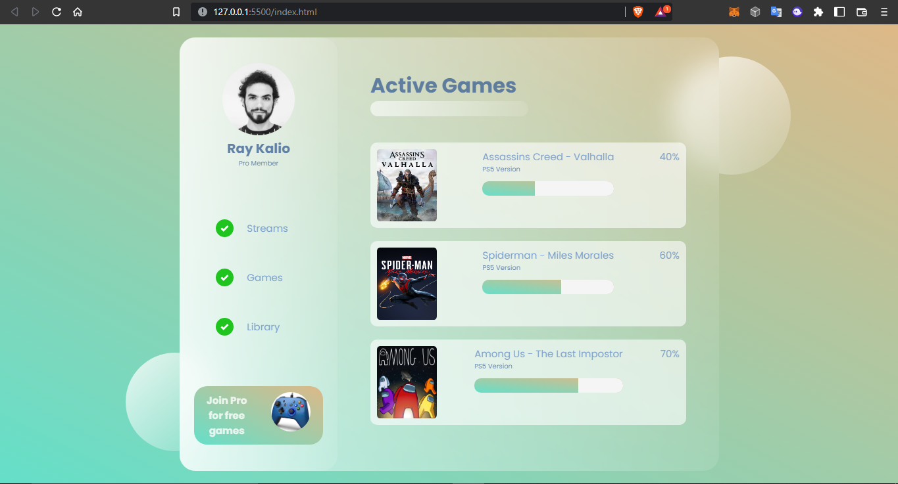

# Glass Dashboard Project 
This is a simple user dashboard of a gaming subscription service built using HTML and CSS.
It was intentionally made to have an appearance of a glass effect, hence the conspicious name lol.

### Requirements for project
---
- HTML
- CSS
- Live server
- Figma

### Things I Learned During This Project:
---
- Using flex in CSS.
- Flex direction & justify content.
- Advanced use of positions (relative & absolute).
- Linear gradient.
- backdrop-filter.
- Using the z-index.
- Advanced use of CSS selectors & functionsa.
- Custom fonts.

*Always do well to check out [W3 Schools](https://www.w3schools.com/css/default.asp) as they have an awesome library of CSS code well documented.*